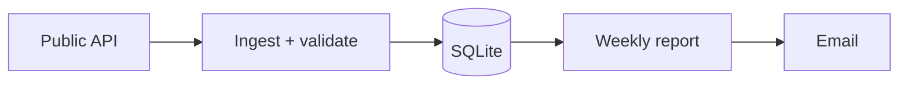

# Mermaid map (structure as a shared diagram)

## Why

Text describes parts; a diagram shows **relationships**. Keeping a Mermaid map in the repo gives the agent (and you) a stable picture of how things connect, so changes respect the structure.

## Which diagram for what

| Need | Mermaid type |
|------|--------------|
| Architecture / data flow | `flowchart` |
| Data model / entities | `erDiagram` |
| Request / interaction flow | `sequenceDiagram` |
| Lifecycle / states | `stateDiagram-v2` |
| Module dependencies | `graph` |

## Example (`MAP.md`)

## Protocol

- Keep the map in a `MAP.md` (or atop the relevant doc). The agent reads it to orient, and **updates it whenever structure changes**.
- One diagram per concern — don't cram architecture, data model, and sequence into one.

## Anti-patterns

- Diagrams that drift out of sync with the real system (worse than none).
- Over-detailed diagrams nobody will maintain. Capture the relationships that matter.
