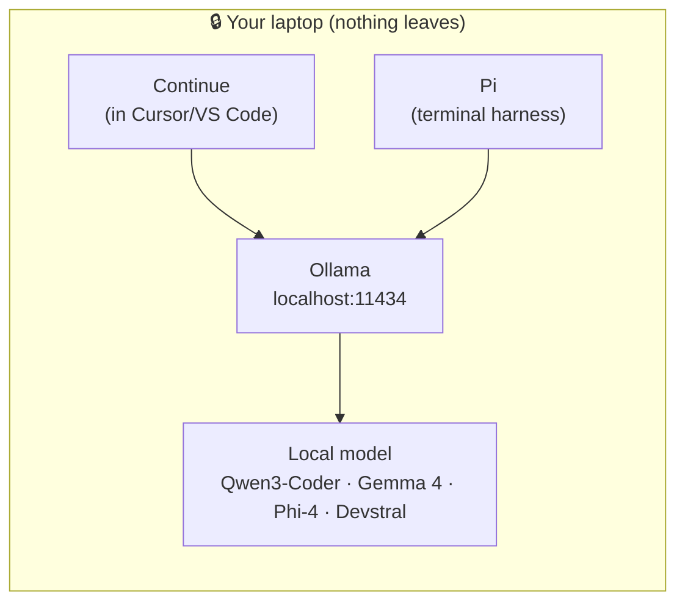

# ⭐ README `/04_local_ai`

> Run capable AI **entirely on your own laptop** — no data center, no cloud, nothing leaving your machine. This is the answer to *"I love this, but I can't send my data anywhere."* You can, in fact, code with an AI agent on a plane with the Wi-Fi off.

---

## Table of Contents

- [The Idea](#the-idea)
- [Activities](#activities)
- [Readings](#readings)
- [The Stack at a Glance](#the-stack-at-a-glance)
- [The Honest Truth About Cursor and Local Models](#-the-honest-truth-about-cursor-and-local-models)

---

## The Idea

Three layers, each swappable:

1. **Ollama** — the *backend*. Downloads and serves models on `localhost`. One install, then everything is a `pull`.
2. **A local model** — *the brain*. Qwen3-Coder for serious coding, Gemma 4 for a fast laptop helper, Phi-4 for reasoning, Devstral if your machine is beefy. See [the model menu](READ_models.md).
3. **A harness** — *the hands*. A coding agent that turns a model into something that reads your files, writes code, and refactors. We feature **Pi** (terminal) and **Continue** (inside Cursor/VS Code) — all pointed at Ollama, all local. See [the harness landscape](READ_harnesses.md) for the full menu.

**Quantization** is what makes this fit on a laptop: compressed model weights (e.g. `Q4_K_M`) that keep most of the intelligence while shrinking memory use. See [the quantization guide](READ_quantization.md).

---

## Activities

Complete these in order:

1. [ACTIVITY: Install Ollama and Serve a Model](ACTIVITY_install_ollama.md)
2. [ACTIVITY: Pull the Right Models for Your Laptop](ACTIVITY_pull_models.md)
    - [`scripts/setup_local_ai.sh`](scripts/setup_local_ai.sh) — one command to install Ollama and pull a sensible model set
3. [ACTIVITY: Pi — A Local Coding Agent in the Terminal](ACTIVITY_pi_local.md)
4. [ACTIVITY: Wire Up Continue (Local Coding in Your Editor)](ACTIVITY_continue_local.md)

---

## Readings

- [READ: The Ollama Harness Landscape (2026)](READ_harnesses.md) — Pi, OpenCode, Aider, Cline, and what faded
- [READ: The Model Menu — Which Local Model Should I Run?](READ_models.md)
- [READ: Quantization, Explained for Laptops](READ_quantization.md)
- [READ: Security & Zero-Trust for AI Output](READ_security.md)

---

## The Stack at a Glance

---

## 🔎 The Honest Truth About Cursor and Local Models

The workshop blurb suggests "pointing Cursor to the Ollama local endpoint for a seamless, private coding experience." In practice, **that is not fully private**, and it's worth being precise:

- **Cursor's Tab autocomplete is locked to Cursor's own model** — it cannot use a local model at all.
- **Custom models in Cursor require a public HTTPS endpoint.** Plain `localhost:11434` is not reachable from Cursor's backend; people work around it with tunnels like `ngrok`, which means your traffic leaves your machine anyway.
- **Cursor builds prompts and manages context on its own servers**, even when the model "runs locally." The compute may be local; the coordination is not.

So if your goal is **genuinely nothing-leaves-the-laptop**, the right tools are **Continue** (in the editor) and **Pi** (in the terminal), both talking directly to Ollama on `localhost`. That's why this module leads with those. Use Cursor for its excellent *cloud* experience; use Continue/Pi when privacy is the requirement.

---

← 🏠 [Back to Top](#table-of-contents)
